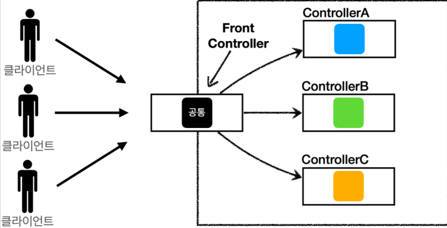

## [인프런] 스프링 MVC 1편 - 백엔드 웹 개발 핵심 기술

## MVC 패턴의 한계

- MVC 패턴을 적용하여 컨트롤러의 역할과 뷰를 렌더링 하는 역할을
구분지을 수 있지만 아래의 단점이 있다.

```java
// MemberSaveControllerV1 코드
String viewPath = "/WEB-INF/views/save-result.jsp";
RequestDispatcher dispatcher = request.getRequestDispatcher(viewPath);
dispatcher.forward(request, response);
```

- 컨트롤러 마다 forward를 통해 View 로 이동하는 코드가 항상 호출된다.

```java
// MemberSaveControllerV1 코드
public class MemberSaveControllerV1 implements ControllerV1 {
    private MemberRepository memberRepository = MemberRepository.getInstance();

    @Override
    public void process(HttpServletRequest request, HttpServletResponse response){
    }
}
```
- 또한 HttpServletRequest request, HttpServletResponse response 를 인자로 받고 있는데,
response 객체는 사용하지 않는 경우도 있다
- 가장 중요한 것은 공통 처리가 어렵다.
- 공통 기능을 메서드로 뽑아도 해당 메서드를 호출해야 하는 것은 마찬가지.

## 프론트 컨트롤러의 등장
- 다른 호출마다 다른 컨트롤러가 직접 호출되는 상황을 벗어나
앞단에 프론트 컨트롤러를 두어서 하나의 서블릿이 여러 요청을 처리하게 된다


